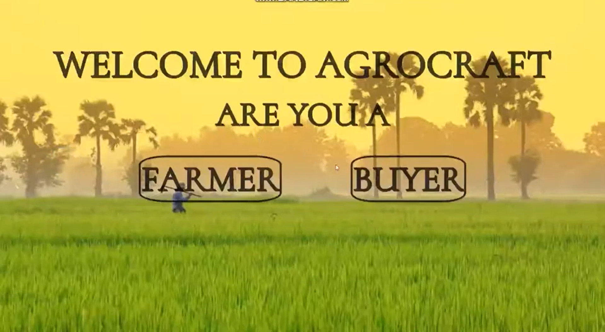
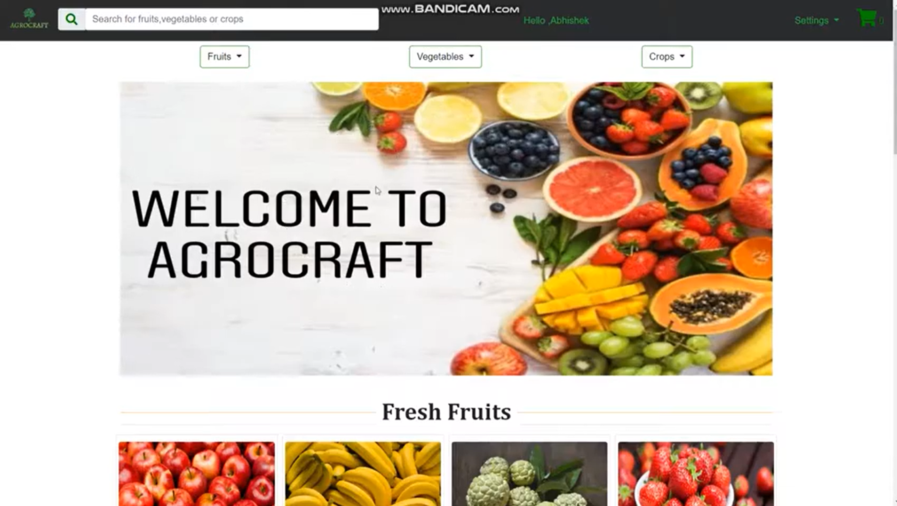
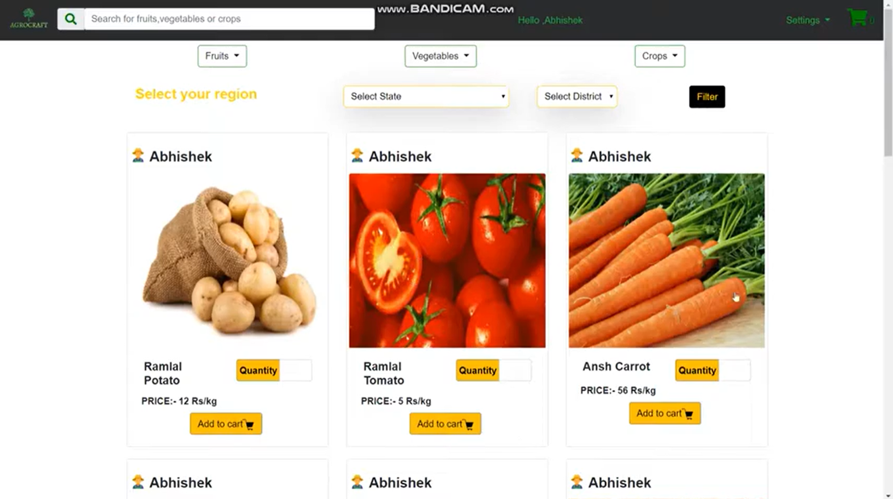
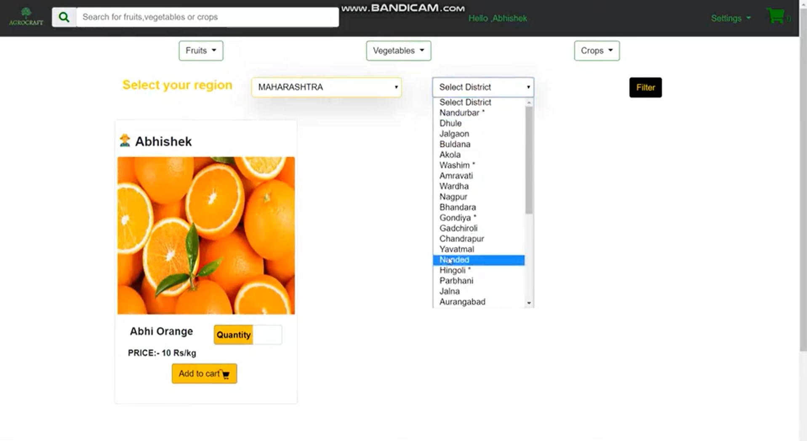

# Agrocraft An E-Commerce Website For Fresh Farm Produce Vegetables And Fruits

#### An E-Commerce Website for farmers to sell their produce at better rates and buyers can purchase those produce via website using categorical and location wise search system. The one of main goal of this project is to eliminate middleman and provide an efficient and robust alternative method to ease the flow of overall market.

#### The applications supports CURD operation for products uploaded by farmers , and it is completely dynamic website build with MySql database and PHP as backend. 

### Starter Images

 
   
  

 
Buyer Homepage
 

 
Products 
 

 
 Categorical and Location Wise Search
   

  
  
## <a href = "https://youtu.be/f0YMvE3muIc" > Click Here </a> To Watch Demo Video

### Technology Stack 
* HTML
* CSS
* JAVASCRIPT
* PHP
* BOOTSTRAP

